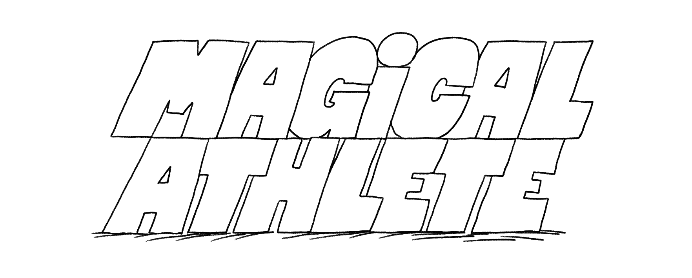
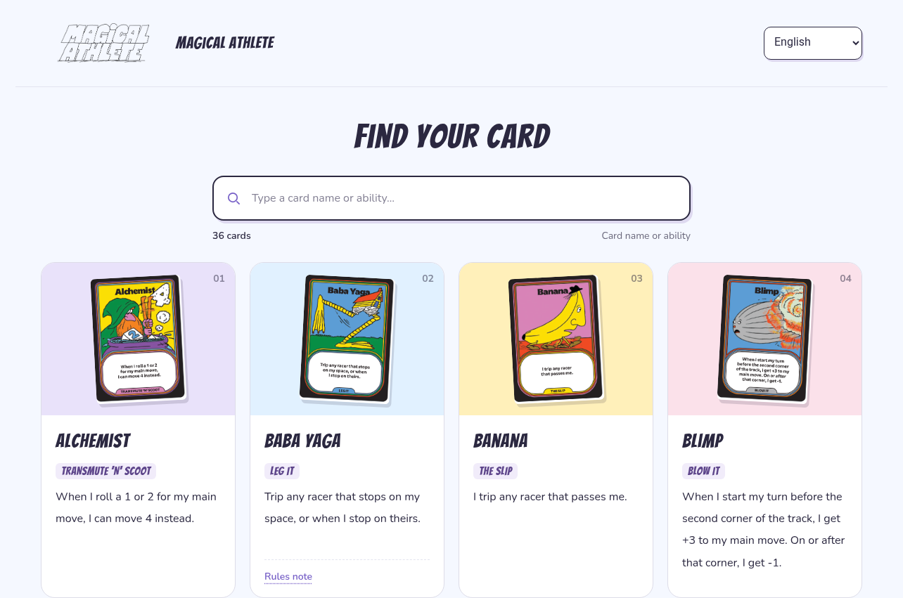
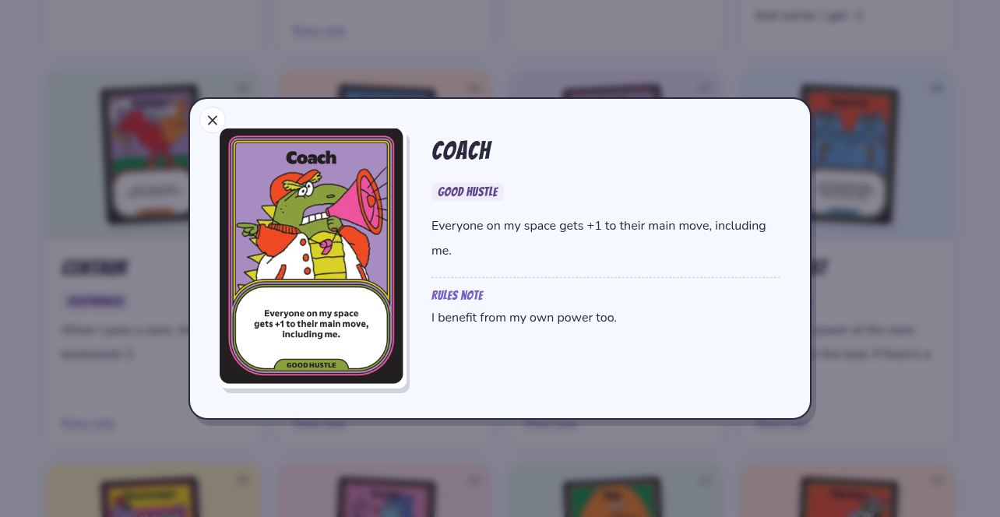

<p align="center">
  
</p>

<p align="center">
  <a href="https://magicalathlete.siyanew.com"><strong>🎲 Try the live demo</strong></a>
</p>

## Screenshots

**Find a card**



**Explore its abilities**



## Development

Requires Node.js 18 or newer. No package installation is needed.

```sh
npm run dev
```

Open the local URL printed in the terminal. The server defaults to port 5173 and tries the next available port when occupied. Set `PORT` to use a specific port:

```sh
PORT=3000 npm run dev
```

## Validate and build

```sh
npm run check
npm run build
```

The build copies the website and its assets to `dist/`.


## Credits

Animated Magical Athlete logo by **Angela Kirkwood**.

## License and contributions

This project is **all rights reserved**, not open source. Independent reuse of Siyanew's original code and documentation requires prior written permission. See [LICENSE](LICENSE).

Card artwork, the animated logo, and other game content remain subject to their respective owners' rights; this repository grants no reuse permission for them. See [ASSET-NOTICE.md](ASSET-NOTICE.md).

Please propose improvements in this repository through issues and pull requests. See [CONTRIBUTING.md](CONTRIBUTING.md). This contribution policy does not remove rights provided by applicable law or GitHub's platform terms.
